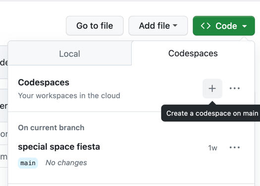

== Empty Repository

This is just an empty repository to play around with some Docs-as-Code and Diagrams-as-Code tools.

To open this repository you have different options:

* clone locally and use the IDE of your choice with plugins for AsciiDoc, PlantUML, draw.io and so on (we recommend IntelliJ IDEA or Visual Studio Code)
* in gitpod: just preface the URL with `gitpod.io#`.
* in Github Codespaces: via button "Code"

Next, in gitpod and Github Codespaces there will be a web based visual studio instance with everything pre-installed.

Open this `README.adoc` and press `Ctrl+k` then `v` to activate the AsciiDoc preview.

=== Part I: AsciiDoc, PlantUML and draw.io

For the Docs-as-Code approach open xref:src/docs/docs-as-code.adoc[]

For the Diagrams-as-Code approach open xref:src/docs/diagrams-as-code.adoc[] and start hacking.

Further informations:

https://docs.asciidoctor.org/asciidoc/latest/syntax-quick-reference/[Ascii Doc cheat sheet]

https://kroki.io/[Kroki Server]

https://plantuml.com/[PlantUML]

'''

=== Part II: full software architecture documentation with arc42 and doctToolchain

To install _docToolchain_, switch to the terminal and run

[code, bash]
----
curl -Lo dtcw doctoolchain.github.io/dtcw
chmod +x dtcw
./dtcw install
----

You'll find more informations at the https://doctoolchain.org/docToolchain/v2.0.x/020_tutorial/010_Install.html[docToolchain tutorial].

We'll use https://arc42.org/[arc42] as template for architecture documentation and can install it as a template in docToolchain.

To preview the files (e.g. html files), start a small server from within the terminal:

[code, bash]
----
python -m http.server 8000
----

Gitpod or Codespaces will now ask you what to do with the opened port. Just click on "open in browser" and navigate through the `build` folder.

=== Practical example

We'll use the sample task for the CPSA‑A examination task of https://www.isaqb.org/[iSAQB] https://www.isaqb.org/certifications/examinations/cpsa-advanced-level-examinations/[advanced level] as an example:
https://www.isaqb.org/download/advanced-level-sample-task-of-the-cpsa-a-examination-task/?wpdmdl=11618[BigSpender]